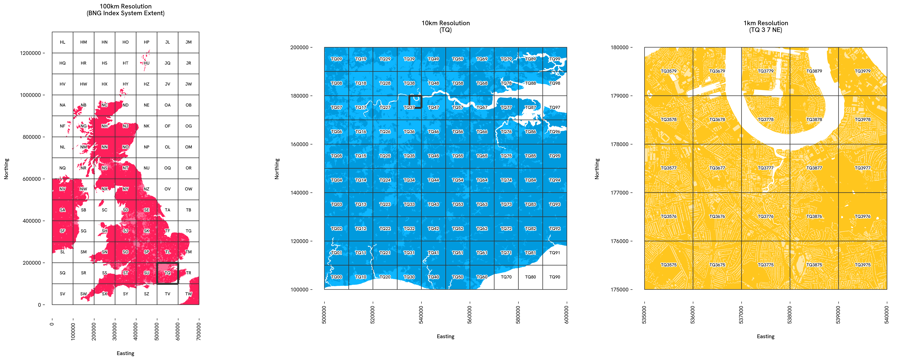

# osbng

A Python library for Ordnance Survey's British National Grid (BNG) index system. This library provides tools for working with the BNG, a rectangular Cartesian grid system used to identify and index locations across Great Britain into grid squares at various resolutions.

## Overview

The `osbng` Python package provides a programmatic interface to the British National Grid (BNG), supporting efficient grid-based indexing and spatial analysis. This enables applications such as statistical aggregation, data visualisation, and data interoperability using BNG grid references. Designed for developers working with geospatial data in the context of Great Britain, the library offers tools to simplify working with the BNG, facilitating both technical integration into geospatial workflows and practical exploration of the index system's structure.

The package supports the 'standard' BNG metre-based resolutions, which represent powers of ten from 1m to 100km (`1m, 10m, 100m, 1km, 10km, 100km`). It also supports the 'intermediate' quadtree resolutions (`5m, 50m, 500m, 5km, 50km`), identified by an ordinal (`NE, SE, SW, NW`) BNG reference direction suffix.



## Installation

Install `osbng` from PyPI using `pip` or conda-forge using `conda`:

``` shell
pip install osbng
```

``` shell
conda install -c conda-forge osbng
```

## Complimentary Tools

* [`osbng-r`](https://github.com/OrdnanceSurvey/osbng-r), an R package with broad parity to the `osbng` Python package.
* [`osbng-grids`](https://github.com/OrdnanceSurvey/osbng-grids), for BNG grid data in GeoParquet and GeoPackage (GPKG) formats.
* [`mosaic`](https://github.com/databrickslabs/mosaic), a Databricks package providing geospatial grid indexing using the BNG for Apache Spark.

## Usage

The `osbng` package is structured into modules supporting different interactions with the BNG index system (e.g. indexing, hierarchy, traversal). A high-level summary of each module is provided below:

### BNG Reference

`osbng` implements a custom `BNGReference` object. This object validates and encapsulates a BNG reference, providing properties and methods to access and manipulate the reference.

``` python
>>> from osbng.bng_reference import BNGReference
>>> bng_ref = BNGReference(bng_ref_string="ST57SE")
>>> bng_ref.bng_ref_formatted
'ST 5 7 SE'
>>> bng_ref.resolution_metres
5000
>>> bng_ref.resolution_label
'5km'
>>> bng_ref.__geo_interface__
{'type': 'Feature',
 'properties': {'bng_ref': 'ST57SE'},
 'geometry': {'type': 'Polygon',
  'coordinates': (((360000.0, 170000.0),
    (360000.0, 175000.0),
    (355000.0, 175000.0),
    (355000.0, 170000.0),
    (360000.0, 170000.0)),)}}
```

### Indexing

Provides the ability to index and work with coordinates and geometries against the BNG index system. This includes:

* Encoding easting and northing coordinates into `BNGReference` objects at a specified resolution.
* Decoding `BNGReference` objects back into coordinates, bounding boxes and grid squares as [`Shapely`](https://github.com/shapely/shapely) geometries.
* Indexing bounding boxes and `Shapely` geometries into grid squares at a specified resolution for spatial analysis.

The following example demonstrates a round trip of constructing of a `BNGReference` object from easting northing coordinates, and the decoding back into coordinates, bounding box and Shapely geometry:

``` python
>>> from osbng.indexing import xy_to_bng
>>> bng_ref = xy_to_bng(easting=356976, northing=171421, resolution="5km")
>>> bng_ref.bng_to_xy(position="lower-left")
(355000, 170000)
>>> bng_ref.bng_to_bbox()
(355000, 170000, 360000, 175000)
>>> bng_ref.bng_to_grid_geom().wkt
'POLYGON ((360000 170000, 360000 175000, 355000 175000, 355000 170000, 360000 170000))'
```

### Hierarchy

Provides functionality to navigate the hierarchical structure of the BNG index system. This includes:

* Returning parents and children of `BNGReference` objects at specified resolutions.

The following example returns the parent of a `BNGReference`:

``` python
>>> bng_ref = BNGReference(bng_ref_string="ST5671SE")
>>> bng_ref.bng_to_parent(resolution="10km")
BNGReference(bng_ref_formatted=ST 5 7, resolution_label=10km)
```

### Traversal

Provides functionality for traversing and calculating distances within the BNG index system. It supports spatial analyses such as distance-constrained nearest neighbour searches and 'distance within' queries by offering:

* Generation of k-discs and k-rings around a given grid square.
* Identification of neighbouring grid squares and checking adjacency.
* Calculating the distance between grid square centroids.
* Retrieving all grid squares within a specified absolute distance.

The following example :

``` python
>>> from osbng.traversal import bng_kring
>>> ...
```

### Grids

Provides functionality to generate BNG grid square data within specified bounds. This includes:

* Returning a GeoJSON-like mapping for grid squares implementing the [`__geo_interface__`](https://gist.github.com/sgillies/2217756) protocol supporting integration with other tools in the Python geospatial ecosystem.
* Grid square data covering the BNG index system bounds is provided as an iterator at 100km, 50km, 10km, 5km and 1km resolutions.

The following example constructs a `GeoPandas` GeoDataFrame from one of the iterators:

``` python
>>> import geopandas as gpd
>>> from osbng.grids import bng_grid_10km
>>> gdf = gpd.GeoDataFrame.from_features(bng_grid_10km, crs=27700)
```

## Contributing

Please raise an issue to discuss features, bugs or general questions.

## License

The `osbng` package is licensed under the terms of the [MIT License](LICENSE).
