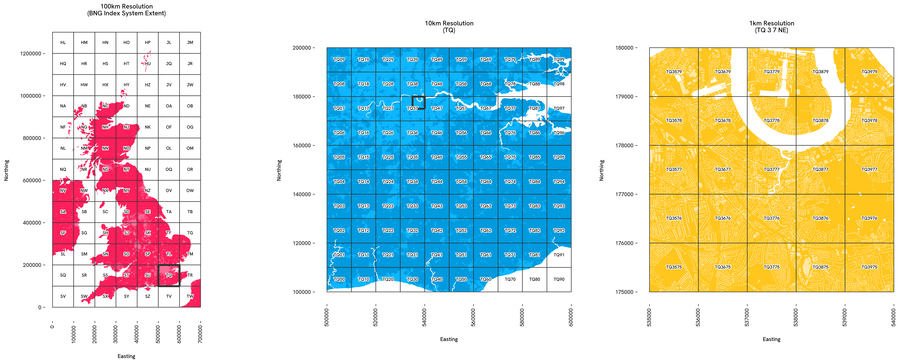
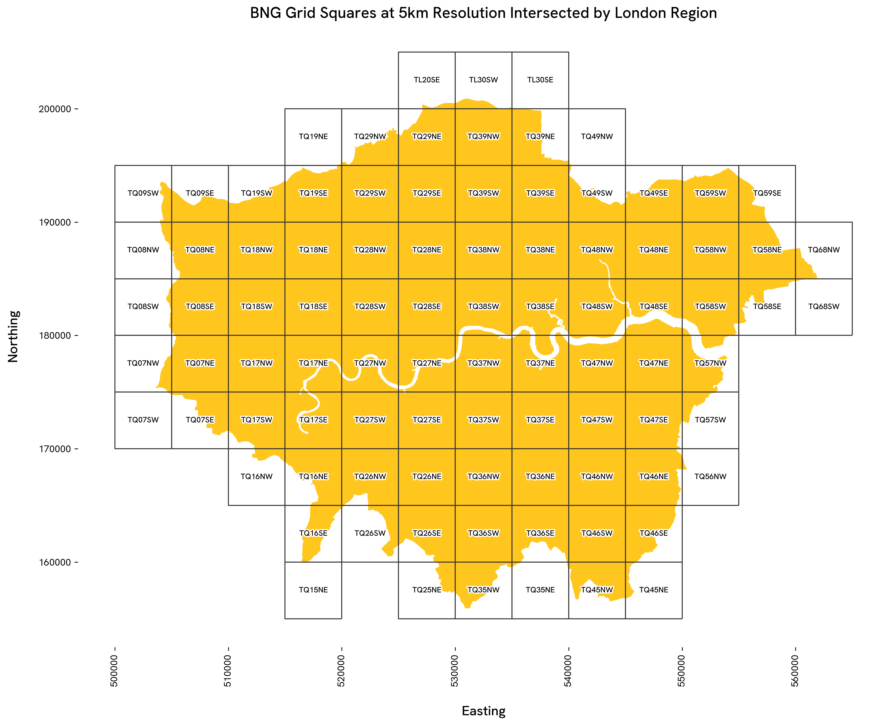
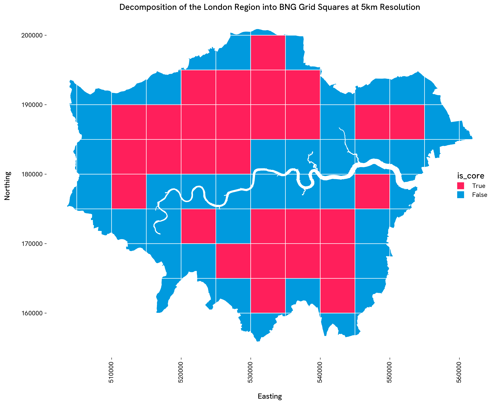

Introduction
============

A Python library for Ordnance Survey’s British National Grid (BNG) index
system. This library provides tools for working with the BNG, a
rectangular Cartesian grid system used to identify and index locations
across Great Britain into grid squares at various resolutions.

Overview
--------

The ``osbng`` package offers a streamlined programmatic interface to
Ordnance Survey's British National Grid (BNG) index system, enabling
efficient spatial indexing and analysis based on grid references. It
supports a range of geospatial applications, including statistical
aggregation, data visualisation, and interoperability across datasets.
Designed for developers and analysts working with geospatial data in
Great Britain, ``osbng`` simplifies integration with geospatial
workflows and provides intuitive tools for exploring the structure and
logic of the BNG system.

The package supports the ‘standard’ BNG metre-based resolutions, which
represent powers of ten from 1m to 100km
(``1m, 10m, 100m, 1km, 10km, 100km``). It also supports the
‘intermediate’ quadtree resolutions (``5m, 50m, 500m, 5km, 50km``),
identified by an ordinal (``NE, SE, SW, NW``) BNG reference direction
suffix.

Installation
------------

Install ``osbng`` from GitHub using ``pip``:

.. code:: shell

   pip install git+https://github.com/OrdnanceSurvey/osbng-py.git

Complimentary Tools
-------------------

- `osbng-r <https://github.com/OrdnanceSurvey/osbng-r>`_, an R package with broad 
  parity to the ``osbng`` Python package.
- `osbng-grids <https://github.com/OrdnanceSurvey/osbng-grids>`_, for BNG grid data in 
  ``GeoParquet`` and ``GeoPackage (GPKG)`` formats.
- `mosaic <https://github.com/databrickslabs/mosaic>`_, a Databricks package providing 
  geospatial grid indexing using the BNG for Apache Spark.

Usage
-----

The ``osbng`` package is structured into modules supporting different
interactions with the BNG index system (e.g. indexing, hierarchy,
traversal). A high-level summary of each module is provided below:

BNG Reference
~~~~~~~~~~~~~

``osbng`` implements a custom ``BNGReference`` object. This object
validates and encapsulates a BNG reference, providing properties and
methods to access and manipulate the reference.

.. code:: python

   >>> from osbng.bng_reference import BNGReference
   >>> bng_ref = BNGReference(bng_ref_string="ST57SE")
   >>> bng_ref.bng_ref_formatted
   'ST 5 7 SE'
   >>> bng_ref.resolution_metres
   5000
   >>> bng_ref.resolution_label
   '5km'
   >>> bng_ref.__geo_interface__
   {'type': 'Feature',
    'properties': {'bng_ref': 'ST57SE'},
    'geometry': {'type': 'Polygon',
     'coordinates': (((360000.0, 170000.0),
       (360000.0, 175000.0),
       (355000.0, 175000.0),
       (355000.0, 170000.0),
       (360000.0, 170000.0)),)}}

Indexing
~~~~~~~~

Provides the ability to index and work with coordinates and geometries
against the BNG index system. This includes:

- Encoding easting and northing coordinates into ``BNGReference``
  objects at a specified resolution.
- Decoding ``BNGReference`` objects back into coordinates, bounding
  boxes and grid squares as
  `Shapely <https://github.com/shapely/shapely>`_ geometries.
- Indexing bounding boxes and `Shapely <https://github.com/shapely/shapely>`_ 
  geometries into grid squares
  at a specified resolution for spatial analysis.

The following example demonstrates a round trip of constructing a
``BNGReference`` object from easting northing coordinates, and then
decoding back into coordinates, bounding box and Shapely geometry:

.. code:: python

   >>> from osbng.indexing import xy_to_bng
   >>> bng_ref = xy_to_bng(easting=356976, northing=171421, resolution="5km")
   >>> bng_ref.bng_to_xy(position="lower-left")
   (355000, 170000)
   >>> bng_ref.bng_to_bbox()
   (355000, 170000, 360000, 175000)
   >>> bng_ref.bng_to_grid_geom().wkt
   'POLYGON ((360000 170000, 360000 175000, 355000 175000, 355000 170000, 360000 170000))'

Indexing GeoPandas (GPD)
~~~~~~~~~~~~~~~~~~~~~~~~

Optional functionality is available when the
`GeoPandas <https://github.com/geopandas/geopandas>`_ package iss
installed. This enables indexing of geometries in a ``GeoDataFrame``
against the BNG index system. Includes:

- Indexing geometries in a ``GeoDataFrame`` into grid squares at a
  specified resolution, and explode the resulting lists of indexed
  objects into a flattened ``GeoDataFrame`` for further analysis.

The following example indexes the boundaries for the 'London' and 'South West' Regions in England:

.. code:: python

   >>> import geopandas as gpd
   >>> from osbng.indexing_gpd import gdf_to_bng_intersection_explode
   >>> gdf = gpd.read_file("docs/examples/data/Regions_December_2024_Boundaries_EN_BFC.gpkg")
   >>> gdf = gdf[gdf["RGN24NM"].isin(["London", "South West"])]
   >>> gdf_to_bng_intersection_explode(gdf=gdf, resolution="5km")
           RGN24CD     RGN24NM   BNG_E  ...                                            bng_ref  is_core                                           geometry
   0     E12000007      London  517517  ...  BNGReference(bng_ref_formatted=TQ 2 8 SE, reso...     True  POLYGON ((530000 180000, 530000 185000, 525000...
   1     E12000007      London  517517  ...  BNGReference(bng_ref_formatted=TQ 1 8 SW, reso...     True  POLYGON ((515000 180000, 515000 185000, 510000...
   2     E12000007      London  517517  ...  BNGReference(bng_ref_formatted=TQ 2 9 SE, reso...     True  POLYGON ((530000 190000, 530000 195000, 525000...
   3     E12000007      London  517517  ...  BNGReference(bng_ref_formatted=TQ 3 9 SW, reso...     True  POLYGON ((535000 190000, 535000 195000, 530000...
   4     E12000007      London  517517  ...  BNGReference(bng_ref_formatted=TQ 5 8 NW, reso...     True  POLYGON ((555000 185000, 555000 190000, 550000...
   ...         ...         ...     ...  ...                                                ...      ...                                                ...
   1410  E12000009  South West  285016  ...  BNGReference(bng_ref_formatted=SS 2 2 SW, reso...    False  POLYGON ((221321.396 120105.5, 221322.097 1200...
   1411  E12000009  South West  285016  ...  BNGReference(bng_ref_formatted=SS 1 4 SW, reso...    False  POLYGON ((214017.097 144997.004, 214015.596 14...
   1412  E12000009  South West  285016  ...  BNGReference(bng_ref_formatted=SS 1 4 NW, reso...    False  POLYGON ((212833.304 145000.003, 212828.101 14...
   1413  E12000009  South West  285016  ...  BNGReference(bng_ref_formatted=ST 2 4 NE, reso...    False  POLYGON ((329353.83 147854.995, 329360.673 147...
   1414  E12000009  South West  285016  ...  BNGReference(bng_ref_formatted=ST 2 6 SW, reso...    False  POLYGON ((323061.501 160841.099, 323064.799 16...
   
   [1415 rows x 10 columns]

Hierarchy
~~~~~~~~~

Provides functionality to navigate the hierarchical structure of the BNG
index system. This includes:

- Returning parents and children of ``BNGReference`` objects at
  specified resolutions.

The following example returns the parent of a ``BNGReference``:

.. code:: python

   >>> bng_ref = BNGReference(bng_ref_string="ST5671SE")
   >>> bng_ref.resolution_label
   '500m'
   >>> bng_ref.bng_to_parent(resolution="10km")
   BNGReference(bng_ref_formatted=ST 5 7, resolution_label=10km)

Traversal
~~~~~~~~~

Provides functionality for traversing and calculating distances within
the BNG index system. It supports spatial analyses such as
distance-constrained nearest neighbour searches and ‘distance within’
queries by offering:

- Generation of k-discs and k-rings around a given grid square.
- Identification of neighbouring grid squares and checking adjacency.
- Calculating the distance between grid square centroids.
- Retrieving all grid squares within a specified absolute distance.

The following example returns a k-disc of a ``BNGReference`` object:

.. code:: python

   >>> bng_ref = BNGReference(bng_ref_string="ST5671SE")
   >>> bng_ref.bng_kdisc(k=1)
   [BNGReference(bng_ref_formatted=ST 56 71 NW, resolution_label=500m),
    BNGReference(bng_ref_formatted=ST 56 71 NE, resolution_label=500m),
    BNGReference(bng_ref_formatted=ST 57 71 NW, resolution_label=500m),
    BNGReference(bng_ref_formatted=ST 56 71 SW, resolution_label=500m),
    BNGReference(bng_ref_formatted=ST 56 71 SE, resolution_label=500m),
    BNGReference(bng_ref_formatted=ST 57 71 SW, resolution_label=500m),
    BNGReference(bng_ref_formatted=ST 56 70 NW, resolution_label=500m),
    BNGReference(bng_ref_formatted=ST 56 70 NE, resolution_label=500m),
    BNGReference(bng_ref_formatted=ST 57 70 NW, resolution_label=500m)]

Grids
~~~~~

Provides functionality to generate BNG grid square data within specified
bounds. This includes:

- Returning a GeoJSON-like mapping for grid squares implementing the
  `__geo_interface__ <https://gist.github.com/sgillies/2217756>`_
  protocol supporting integration with other tools in the Python
  geospatial ecosystem.
- Grid square data covering the BNG index system bounds is provided as
  an iterator at 100km, 50km, 10km, 5km and 1km resolutions.

The following example constructs a ``GeoPandas`` GeoDataFrame from one
of the iterators:

.. code:: python

   >>> import geopandas as gpd
   >>> from osbng.grids import bng_grid_10km
   >>> gdf = gpd.GeoDataFrame.from_features(bng_grid_10km, crs=27700)

Contributing
------------

Please raise an issue to discuss features, bugs or ask general
questions.

License
-------

The ``osbng`` package is licensed under the terms of the `MIT
License <LICENSE>`__.

.. |BNG Grid Squares at 5km Resolution Intersected by London Region| image:: docs/_static/images/osbng_indexing_geom_to_bng_5km_london.png
.. |Decomposition of the London Region into BNG Grid Squares at 5km Resolution| image:: docs/_static/images/osbng_indexing_geom_to_bng_intersection_5km_london.png
